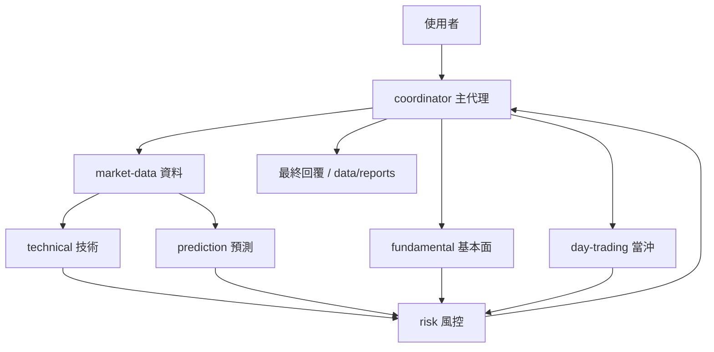

# Hermes 代理人分工

## 定義與執行分開

- `AGENTS.md`：共通限制與角色入口，啟動時讀取。
- `agents/coordinator.md`：主代理分派規則。
- `agents/<role>.md`：六個專業角色的職責、命令與邊界。
- `agents/contracts.md`：共享交接契約與寫入責任。
- `hermes/skills/twstock-coach/SKILL.md`：技能路由入口，不重複所有角色內容。
- `docs/analysis-language.md`：白話術語與最終輸出。

這是以專案 Markdown 約定角色、使用 Hermes `delegate_task` 建立子代理人的設計；不是把檔案自動註冊成 profiles，也不建立七份持久記憶。角色限制是代理人指令，不是作業系統沙箱或工具權限隔離。



箭頭代表由主代理協調的資料交接，子代理不直接互相分派。未要求的分析不啟動。

## 啟動

```powershell
# 互動模式：支援專業子代理人委派
.\run.ps1

# 單次模式：依角色規範循序分析，不啟動非同步子代理
.\run.ps1 -Query "分析台積電"
```

```bash
./run.sh
./run.sh "分析台積電"
```

互動模式明確使用 `terminal,skills,web,delegation`；PowerShell 可用 `-Tools` 自訂。只啟用工具不代表每次都要全部使用。

目前安裝的 Hermes 將 `-q` 查詢作單輪執行，非同步委派未必能在退出前完成後續整合。因此啟動腳本的單次模式排除 delegation，維持有限、循序處理；要實際多代理協作請使用互動模式。不要把一次 dispatch 成功當成已完成整合。

沿用既有 `HERMES_HOME`，未設定時使用系統預設（Windows `%LOCALAPPDATA%/hermes`，Linux/macOS `~/.hermes`）。本次不更改全域模型、SOUL 或個人記憶。專案 `agents/` 的角色定義由主代理讀取後傳入委派上下文。

## 委派範例

下列是主代理的工具呼叫示意，不是 Python CLI 或已執行的任務。實際值須替換成本次根目錄、直譯器、資料與時間。

```python
# 先讀取 AGENTS.md、agents/contracts.md、agents/technical.md 的內容。
# shared_rules、contract、role_definition 是讀到的文字，不是檔名占位符。
delegate_task(
    goal="依 technical 角色分析 2330 日線，回傳契約 JSON，不再委派",
    context=shared_rules + contract + role_definition + task_context
)
```

`task_context` 至少包含：

```json
{
  "task_id": "2330-review-unique-id",
  "role": "technical",
  "project_root": "D:/AI/TWStock-Coach",
  "python": "D:/AI/TWStock-Coach/.venv/Scripts/python.exe",
  "code": "2330",
  "horizon": "daily",
  "requested_at": "實際查詢時間，含 +08:00",
  "data_dir": "D:/AI/TWStock-Coach/data",
  "market_code": null,
  "output_dir": "D:/AI/TWStock-Coach/data/tmp/agents/2330-review-unique-id/technical",
  "inputs": ["資料代理已驗證的 CSV 路徑、日期、列數與品質結果"],
  "write_scope": "僅 output_dir；共用 CSV 唯讀"
}
```

等資料角色回報後才委派日線分析；技術與基本面可以 tasks 批次獨立執行。收到必要結果後再把各份證據交給 risk。不得憑分派狀態宣稱收到專業結果。

## 當沖流程

直接分派 day-trading 確認交易日、報價日期與快照時間，再由 risk 檢查流動性、限制及時間有效性。需要日線背景才另行準備資料，不能讓三年歷史／調參延誤快照。

當前 day-trade 輸出缺完整報價日期，也含需審慎核對的制式風險文字；角色必須查證日期、資格及交易方向，不能盲目轉述。角色規範能要求檢查，但不等於底層 API 已提供缺少的資料。

## 維護與驗證

新增角色先寫定義，再更新主代理路由；不要把整份角色內容搬回 AGENTS.md 或 skill。新增功能在 MVC 對應層實作並登錄統一 CLI。別名維護於 market-data，白話術語維護於 analysis-language。

離線驗證包括角色連結、命令、啟動參數傳遞與原有 Python 測試。不需啟動付費模型即可檢查文件接線；實際委派品質須在互動 Hermes 中驗證：查看 delegate_task 呼叫、角色回傳狀態與證據，而不是只看主代理自述。

官方資料：[子代理人委派](https://hermes-agent.nousresearch.com/docs/user-guide/features/delegation)、[Profiles 與獨立狀態](https://hermes-agent.nousresearch.com/docs/user-guide/profiles)。
## Hermes 網頁 Chat

使用 `./run.ps1 -Dashboard`（Windows）或 `./run.sh --dashboard`（Linux/macOS）啟動 Hermes 內建 Chat，沿用本專案主代理與角色規範。工作目錄、工具集、趨勢圖下載及限制見 [Dashboard 整合](hermes-dashboard.md)。
