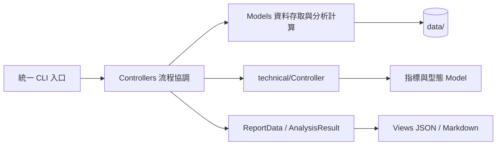

# 專案結構 Architecture

```
twstock-coach/
├── agents/                   # 主代理與專業角色、交接契約
│
├── hermes/                   # 版控中的自訂 skills 與 plugins
│
├── scripts/
│   ├── __init__.py           # 套件標記
│   ├── __main__.py           # python -m scripts <功能>
│   ├── common/
│   │   └── paths.py          # data/ 路徑邊界
│   ├── models/               # 資料存取、領域計算、ML 與回測
│   │   ├── repository.py     # 共用 CSV/JSON 讀寫、來源驗證
│   │   ├── market_data.py    # 行情 API
│   │   ├── institutional.py  # 籌碼 API、統計及特徵
│   │   ├── prediction.py    # 特徵工程與預測模型
│   │   ├── backtest.py       # walk-forward 計算
│   │   └── report.py         # ReportData 資料結構
│   ├── controllers/          # CLI 參數、資料補抓、分析流程協調
│   │   ├── history.py        # 365 / 730 / 1095 天補抓
│   │   ├── report_generator.py # 彙整 ReportData 與風控計算
│   │   └── ...               # 各功能流程與調參／候選掃描
│   ├── views/                # 不查 API、不訓練模型、不決定交易規則
│   │   ├── console.py        # CLI 文字與 JSON 輸出
│   │   └── report.py         # ReportData → Markdown
│   └── technical/            # 保留技術領域既有 MVC 模組
│       ├── indicators.py / patterns.py / models.py
│       ├── controller.py / views.py
│       └── facade.py         # TechnicalAnalyzer 舊 API 轉接
│
├── tests/                    # 單元與離線整合測試
│
├── data/                     # 股票歷史資料快取（gitignore）
│   ├── 0050_history.csv      # 大盤代理（跨資產特徵來源）
│   ├── 2330_history.csv
│   ├── models/               # 調參結果與模型
│   ├── reports/              # 分析報告
│   ├── backtests/            # 回測輸出
│   └── tmp/                  # 暫存與驗證產物
│
├── docs/                     # 設計文件（本資料夾）
│   ├── architecture.md       # 專案結構（本檔）
│   ├── ml-pipeline.md        # ML 模型設計
│   ├── backtest.md           # 回測方法
│   ├── agent-guide.md        # Agent 互動設計
│   └── technical-analysis.md # 技術面指標與訊號規則
│
├── AGENTS.md                 # Hermes 啟動時自動載入的工作區上下文
├── README.md                 # 專案首頁
├── requirements.txt          # Python 依賴
├── setup.ps1 / setup.sh      # 一鍵安裝腳本
└── run.ps1 / run.sh          # 啟動 hermes agent
```

## 模組職責

| 模組 | 輸入 | 輸出 | 上游 | 下游 |
|------|------|------|------|------|
| `fetch_stock_data` | 股票代碼、天數 | CSV 歷史檔 / JSON 即時報價 | TWSE/TPEX API | 其他所有腳本 |
| `technical_analysis` | CSV 歷史檔 | JSON 指標值 + 訊號 | fetch | report |
| `fundamental_analysis` | 個股代碼 | JSON 本益比/殖利率/淨值比/月營收/獲利能力 | TWSE OpenAPI | report |
| `etf_analysis` | ETF 代碼 | JSON 追蹤指數/保管機構等基本資料 | TWSE OpenAPI | report |
| `day_trading_analysis` | 股票代碼 | JSON 即時快照 + 風控訊號（振幅/區間位置/漲跌停距離/五檔） | TWSE 即時 + OpenAPI | report（選項） |
| `institutional_data` | 個股代碼或大盤日期區間 | 個股/大盤法人籌碼 JSON + CSV | TWSE/TPEX/TDCC | report + ML |
| `prediction_model` | CSV + 大盤 CSV + 參數 | JSON 預測 + 訊號 | fetch + tune | report + backtest |
| `backtest` | CSV + 參數 + 止損設定 | JSON 績效（含 realistic 區塊） | fetch + tune | （CLI 直接看） |
| `tune` | CSV + 大盤 CSV | `data/models/<code>_best_params.json` | fetch | prediction + backtest |
| `report_generator` | 股票代碼 | 統一格式報告 | 上面全部 | hermes agent |

## MVC 邊界與資料流



- Model 不解析 CLI 或輸出文字，也不匯入 Controller、View 或根層入口。
- Controller 協調 Model、呼叫 View，接收統一 CLI 傳入的參數。
- View 只呈現已計算的結果，不能讀 CSV、呼叫 API、訓練模型或重新計算止損。
- 技術面依 `technical/` 的既有領域 MVC 維護；其他功能依 `models/`、`controllers/`、`views/` 分層，避免複製指標公式。
- `scripts/models/` 是版本管理中的 Python 原始碼；`data/models/` 才是忽略版控的模型產物。
- 在專案根目錄使用 `python -m scripts <功能>`，如 `technical`、`report`、`backtest`；`python -m scripts --help` 列出全部功能。原本 `python scripts/<入口>.py` 與根層 API 匯入路徑已移除。程式碼請直接匯入 `scripts.models`、`scripts.controllers` 或 `scripts.technical` 下的模組。

## 驗證

```bash
python -B -m unittest discover -s tests -v
```

測試涵蓋統一 CLI 分派、指標一致性、來源代碼驗證、籌碼快取、大盤法人 CLI、報告選項、Model → Controller → View 整合與 `data/` 路徑邊界。測試資料與重構備份留在 `data/tmp/`。

## 設計原則

1. **無 hardcode**：個股功能使用 `--code`；大盤法人與候選掃描使用各自的篩選參數
2. **時序嚴格**：walk-forward 切分，訓練集永遠在預測集之前，無未來資料洩漏
3. **失敗自動補救**：抓不到資料 → 自動加大天數重試（見 AGENTS.md「動態決策邏輯」）
4. **白話優先**：agent 層負責把所有數字翻譯成人話，腳本只負責算
5. **可選增強**：Optuna 參數、跨資產特徵都是可選，沒有也能跑

Hermes 執行資料位於系統使用者目錄：Windows `%LOCALAPPDATA%/hermes`，Linux/macOS `~/.hermes`；既有 `HERMES_HOME` 優先。
## 趨勢圖輸出

`technical --chart` 由 `TechnicalAnalysisController.trend_chart` 準備 `TrendChartData`，均線共用 `IndicatorCalculator.sma_series`。`technical/chart_view.py` 只繪製已計算序列；CLI 將 PNG 與 Markdown 寫入 `data/reports/`，並回傳 artifacts 路徑。Hermes Dashboard 啟動與圖檔呈現見 [整合說明](hermes-dashboard.md)。
